# Sprint 1

## Desafio 

### Entregáveis

* Todos os arquivos de dados_de_vendas.csv
* Todos os arquivos de scripts gerados
* Arquivo de evidências da execução contendo imagens/prints das execuções
* Arquivo escrito no formato Markdown, contendo todos os passos para reexecução do desafio
  

1. Crie um diretório chamado ecommerce e insira o arquivo dados_de_vendas.csv nele
   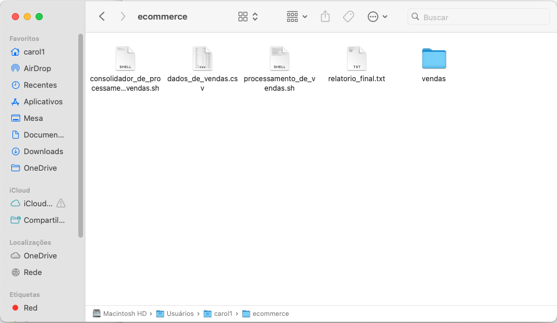

2. Crie um arquivo executável denominado 'processamento_de_vendas.sh', que realize as seguintes tarefas, usando comandos Linux (Ubuntu 22):

- 2.1. ⁠Criar um diretório denominado ⁠ vendas/ ⁠ e copiar o arquivo ⁠ dados_de_vendas.csv ⁠ para dentro dele.

- 2.2. ⁠Dentro do diretório ⁠ vendas/ ⁠, criar um subdiretório denominado ⁠ backup/ ⁠ e copiar o arquivo ⁠ dados_de_vendas.csv ⁠ para dentro dele com a data de execução como parte do nome do arquivo no padrão yyyymmdd procedido de hifen. Por exemplo: ⁠ dados-20230831.csv ⁠.

- 2.3⁠. ⁠Dentro do diretório ⁠ backup/ ⁠, renomear o arquivo copiado para ⁠ backup-dados-<yyyymmdd>.csv ⁠. Por exemplo: ⁠ backup-dados-20230831.csv ⁠.

- 2.4. ⁠Dentro do diretório ⁠ backup/ ⁠, criar um arquivo chamado ⁠ relatorio.txt ⁠ que contenha as seguintes informações:

    - Data do sistema operacional, no formato YYYY/MM/DD HH:MI.
    - ⁠Data do primeiro registro de venda contido no arquivo.
    - ⁠Data do ultimo registro de venda contido no arquivo.
    - ⁠A quantidade total de itens diferentes vendidos.
    - ⁠Dentro do diretório ⁠ backup/ ⁠, mostre as 10 primeiras linhas do arquivo ⁠ backup-dados <yyyymmdd>.csv ⁠ e as inclua no diretório ⁠ relatorio.txt ⁠.

3.⁠ ⁠Comprimir o arquivo backup-dados-<yyyymmmdd>.csv para backup-dados-<yyyymmmdd>.zip ⁠.
 
 
4.⁠ ⁠Apagar o arquivo ⁠ backup-dados-<yyyymmdd>.csv ⁠ do diretório ⁠ backup/ ⁠ e o arquivo ⁠ dados_de_vendas.csv ⁠ do diretório ⁠ vendas/ ⁠.
   
   
  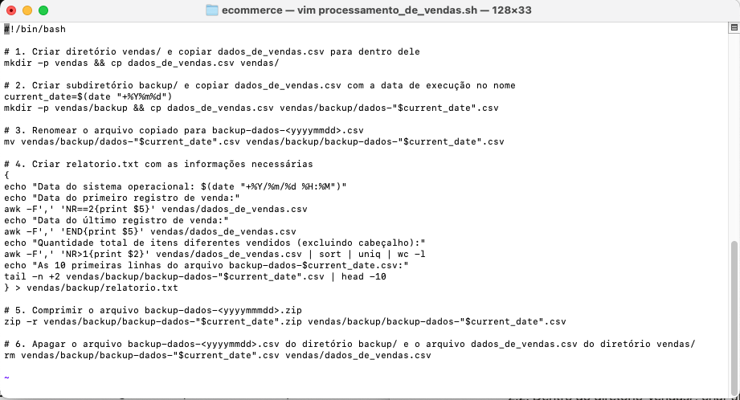
   
   
  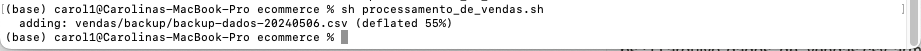
   
   
  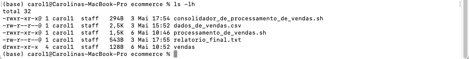
   
   
  
   
   
  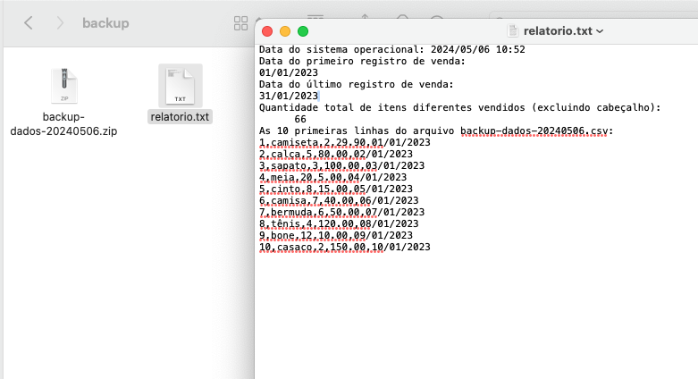
   
   
  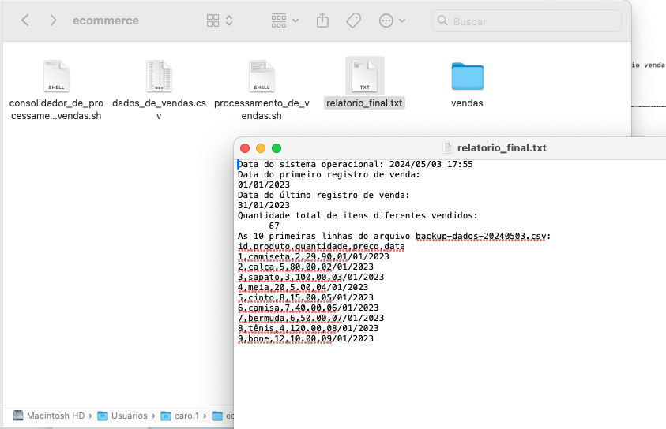
   
   
5. Além disso, agende a execução de comandos Linux para executar o script processamento_de_vendas.sh ⁠ todos os dias, de segunda à quinta às 15:27. Não esqueça de habilitar as permissões para a execução do script.
 
 
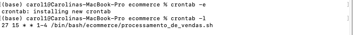
 
 
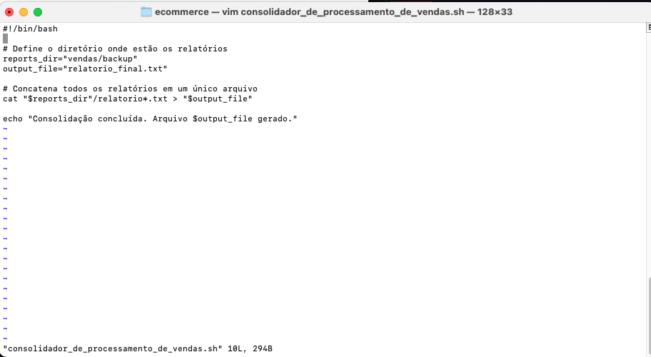
 
 
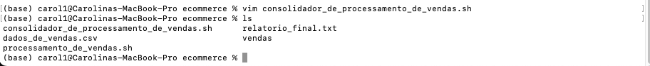
 
 
6. Por fim, crie um script chamado ⁠ consolidador_de_processamento_de_vendas.sh ⁠ que une todos os relatórios gerados e gere outro arquivo chamado ⁠ relatorio_final.txt ⁠.
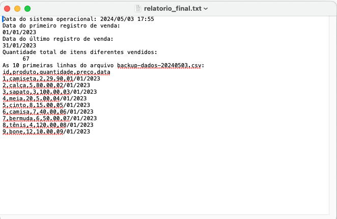
 
 
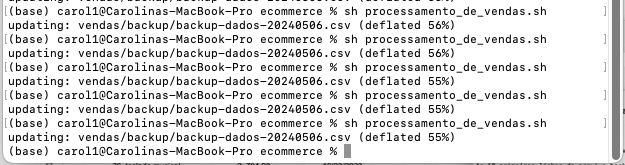
 
 
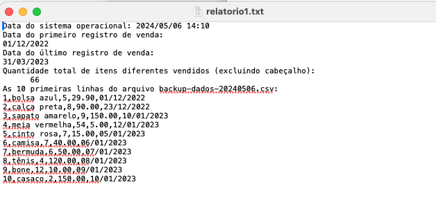
 
 
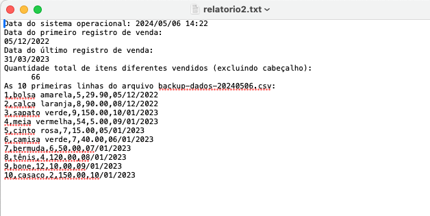
 
 
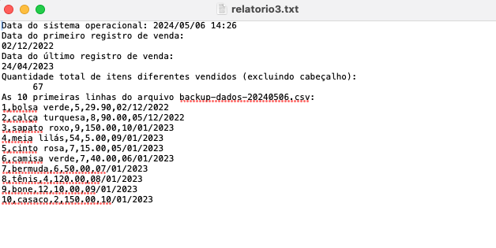
 
 
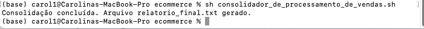
 
 
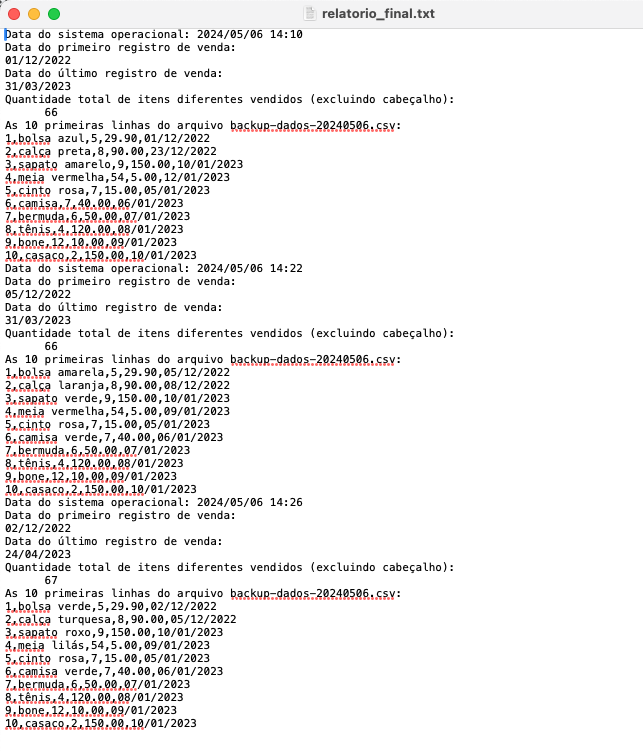
 
 
Obs.: O arquivo ⁠ dados_de_vendas.csv ⁠ armazena as informações no formato id, produto, quantidade, preco, data. Por exemplo: 1, camiseta, 2, 29.90, 01/01/2023.
